# PORTFOLIO PROJECT 1

# Japan - A Seasonal Travel Guide

## SITE PURPOSE

Japan - A Seasonal Travel Guide is a website that informs users about aspects of the different seasons in Japan and gives examples of activities that are a must-do during each season. It also offers a newsletter sign up, which provides the subscriber with ideas for seasonal activities taking place exclusively in Japan.
[Here is a link to the final project](https://runabrandes.github.io/portfolio-project-1/)

## FINAL DESIGN

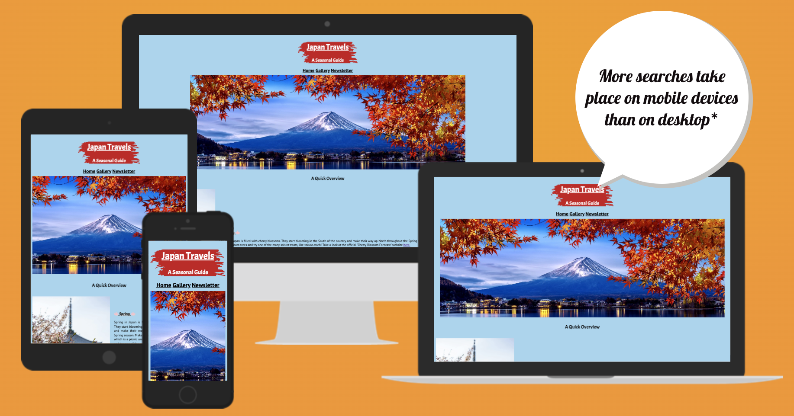 [Am  I Responsive](https://amiresponsive.co.uk/)

## PROJECT IDEA

My idea for this project was to create a website that informs the user about activities and seasonal aspects in Japan. My husband and I are planning to travel to Japan in 2025 and have researched the aspects of each season extensively to help us determine which of the four would be our preferred season to visit Japan. There are lots of different activities that are exclusive to Japan to choose from, like the Cherry Blossom season and a variety of shrine festivals.

  The Features I wanted the project website to have are:

* Pages are easy to read and navigate
* Images that make the users want to see more of the country
* Simple newsletter sign up form

#

## UX/UI

* The page is informative
* The page is simple to understand and navigate
* The page content is easy to read
* The images used are clear and fit the content

## SITE GOALS

* Providing users with an easy to read and navigate website
* Providing users with a good amount of information and make them keen to sign up to the newsletter
* To make the site accessible

## USER STORIES

* As a user, I want to easily understand the main purpose of the website
* As a user, I want to be able to navigate the site with a navigation bar
* As a user, I want the site to inform me of what the website description promises
* As a user, I want to see images related to the website content
  
#

## WIREFRAMES

* Wireframes for mobile and desktop:

* Wireframes for Home Page
  
  

  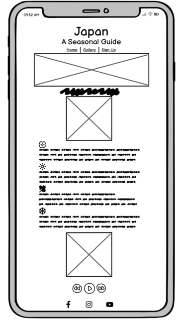

* Wireframes for Gallery page

  

  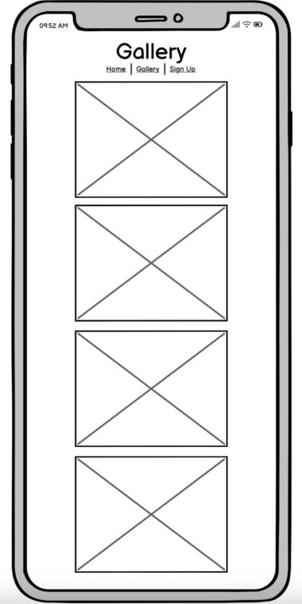

* Wireframes for Newsletter page

  

  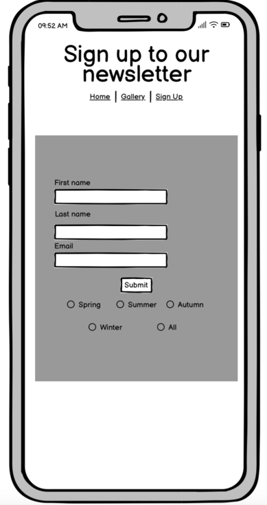

* Wireframes for Thank you page

  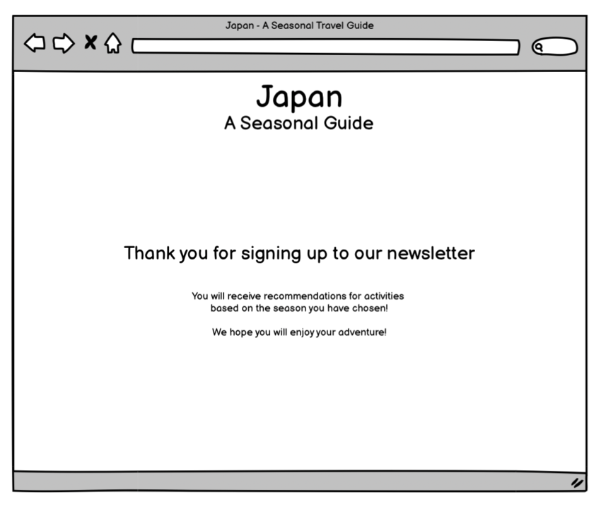

  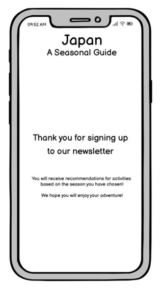

#

## WEBSITE FEATURES

* The website consists of:
  * 4 pages in total. A Home page, a Gallery page, a Newletter Sign Up page and a Thank You page.
  * Each page has the same body layout, header (title), navbar (navigation), main (text and / or images) and footer (social media icons and links).

* Home page
  * The Home page features a hero image of Mount Fuji in autumn to allow for the user to get right into the mindset of browsing the website and get excited to learn more about the topic of seasons in Japan. 

  * The main part of the home page has a brief description of some core factors of each season in Japan. It also features images and an audio file which are designed to make the used feel as if they have already started their holiday in Japan.
  
  

  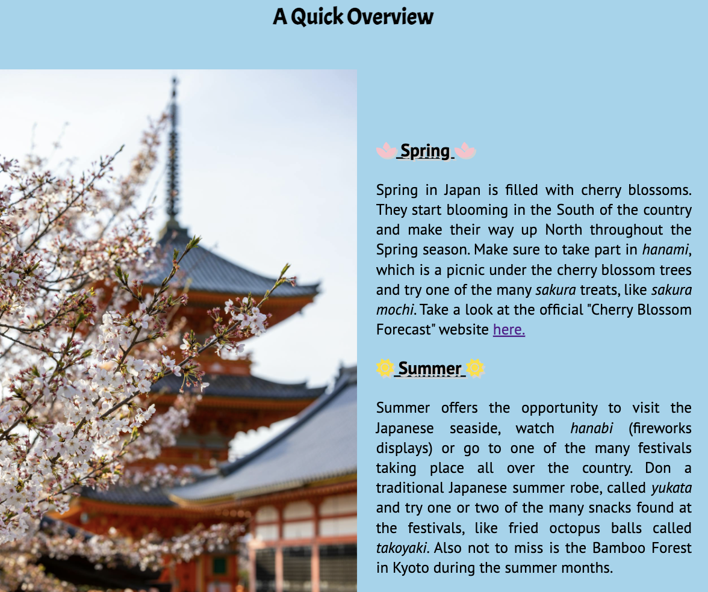
  
  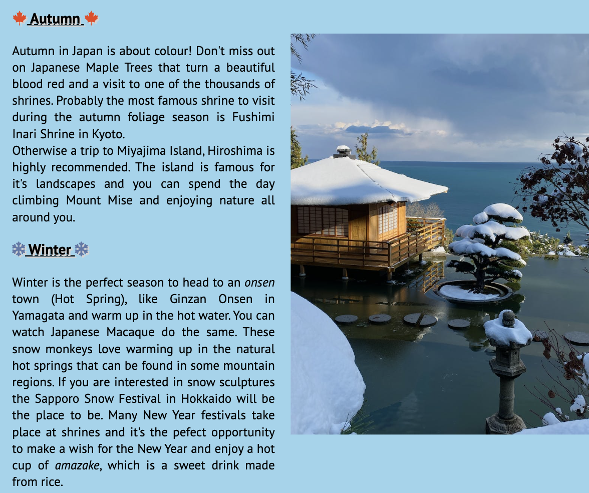
  
  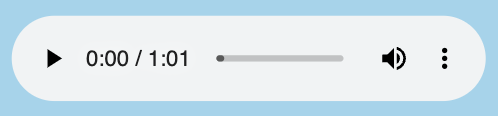

* Gallery
  * Features 11 images in total. All the images relate to Japan during different seasons, creating an interesting page for the user.

  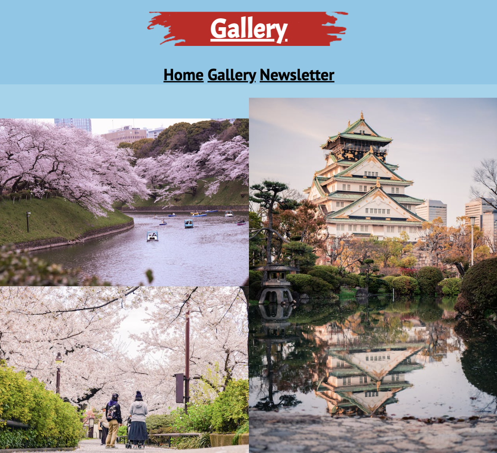

* Sign Up page
  * Has a form to include first name, last name, email address and radio buttons to select from five selections. (Spring, Summer, Autumn, Winter, All). It also features a background image on screens that are larger than 768px.
  
  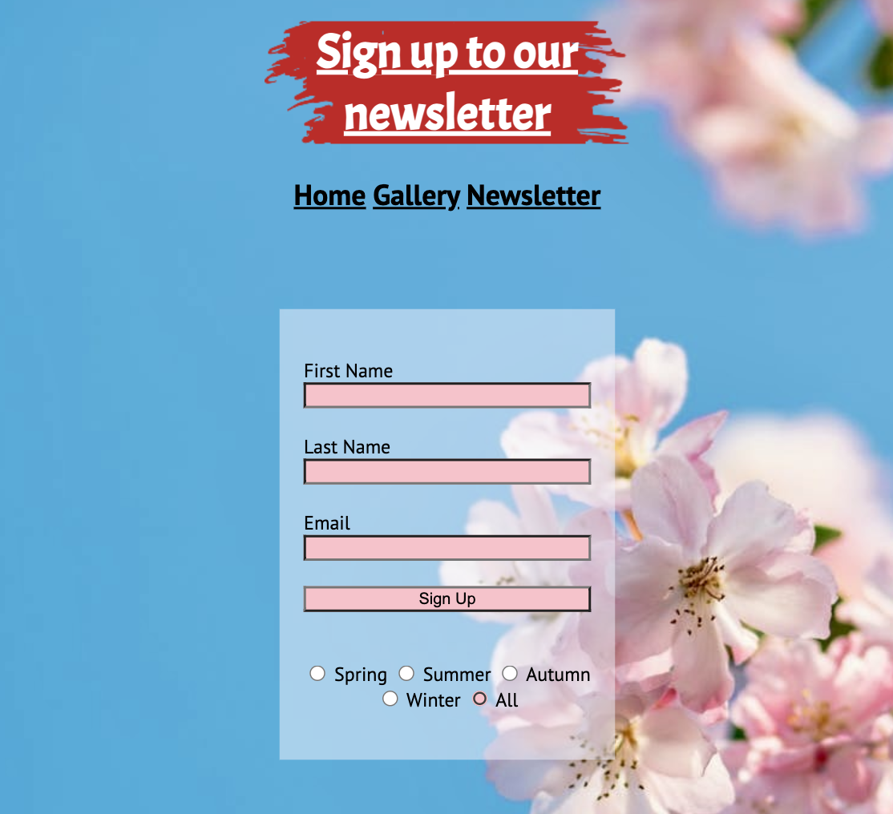

* Sign up form
  * Form validation requests the user to input the required information in the different input fields. The submit button has a link to the Thank You page.
  
   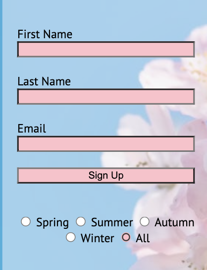

* Thank You page
  * The Thank You page can be reached when submitting the sign up form. If all required information has been entered, clicking the submit button will take you to the Thank You page.

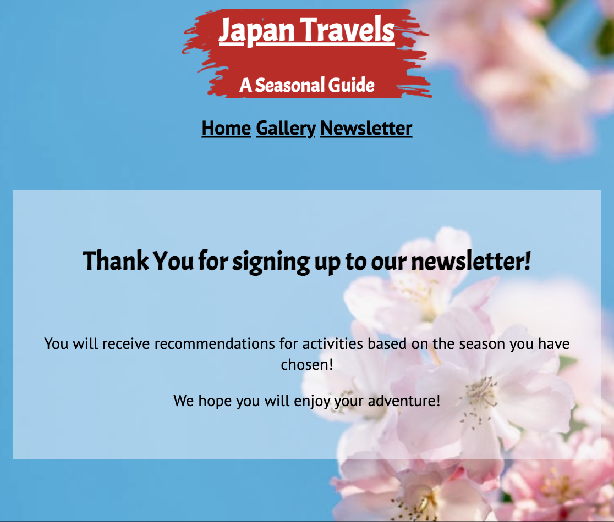

* Header
  * The header is a dark red paint brush background with h1 and h2 elements that are white.
  
  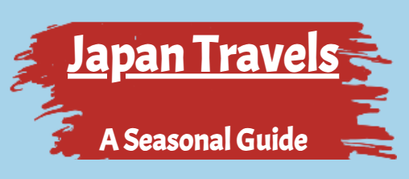
  
* Navbar
  * The navigation bar has 3 links that take the user to either home, gallery or sign up.

  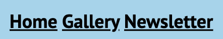

* Footer
  * The Footer contains Social media links (Instagram, Facebook, YouTube) that take you to the relevant website's home page.
  
  

#

## DESIGN

* Colour Scheme:
  * The colour scheme used for the website was an idea of using calm and content related colours in conjunction. The header is a combination of a white font with a deep red background, which was inspired by the colours of the Japanese flag.
  * The overall background colour is a light blue which was inspired by nature and wide blue skies, also this colour makes it easy to read the general texts on the website, as aside from the header font, the overall font colour used is a simple black colour.
  * The blue background colour for the Home and Gallery pages was taken from the background image used for the Newsletter Sign Up and the Thank you pages, as the background image for these pages is a picture featuring a blue background with pink cherry blossoms in the foreground. The pink aspects of the cherry blossom were also integrated into the sign up form, as the text input fields, the sign up button and the radio buttons all feature a pink shade.
  * There was also a light grey used for the sign up form and text div on the Sign Up page and Thank You page to allow the users to be able to easily read the text, even though these pages feature a background image. The colour is slightly opaque so the background image is still visible.
  * The footer colour is black, which makes it stand out from the entire page and allows the social media icon colours to really "pop", which will draw the user's attention. The icon colours for the social media icons have been taken from the actual icons, as I have used the Chrome Developer Tools "colour picker tool" on them and was able to find out the hex/rgb codes for them that way. The Instagram icon is a bright pink, the Facebook icon is a shade of dark blue and the YouTube icon is a bright red.
  
  * Colours with their rgb codes can be found below:
  *  rgb(255, 255, 255)
  *  rgb(202, 20, 30)
  *  rgb(0, 0, 0)
  *  rbg(57, 172, 221)
  *  rgb(0, 6, 49)
  * 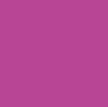 rgb(199, 58, 152)
  *  rgb(26, 120, 242)
  *  rgb(255, 0, 0)
  * 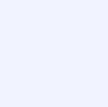 rgb(243, 243, 255)
  * 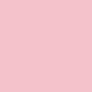 rgb(255, 192, 203)

* TYPOGRAPHY
  * The fonts used for my website are "Acme" and "PT Sans". "Acme" was used for the h1 and h2 elements. "PT Sans" was used for the rest of the website. The backup font for the entire website is sans-serif. The fonts are imported from Google Fonts.
  
* IMAGES / AUDIO
  * The image of the red paint stroke for the heading of the website was taken from [pngegg.com](https://www.pngegg.com/)
  * All other images used for the website, like the gallery and background pictures were downloaded from [freepik.com](https://www.freepik.com/) and [pexels.com](https://www.pexels.com/).
  * The audio, which can be found at the bottom of the home page, was downloaded from [fesliyanstudios.com](https://www.fesliyanstudios.com/)

#
